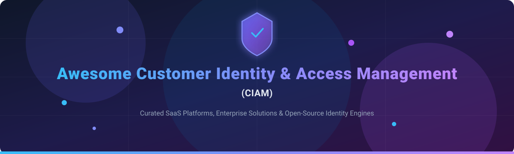

# 🔐 Awesome Customer Identity & Access Management (CIAM) 🚀

  
  
  
  
  
  

---

## 💡 Overview

Welcome to the ultimate curated directory of **Customer Identity & Access Management (CIAM)** solutions! ⚡ Whether you are building a modern web application, scaling a B2B SaaS platform, or architecting enterprise single sign-on (SSO), selecting the right identity infrastructure is critical for security, user experience, and scalability.

This repository tracks top-tier **SaaS platforms**, enterprise IDaaS vendors, and self-hosted **open-source identity engines** supporting Customer Authentication, OAuth2/OIDC, Passkeys, Multi-Factor Authentication (MFA), SAML SSO, and Multi-Tenancy Organization modeling.

---

## 📖 Table of Contents

- [☁️ SaaS & Hosted CIAM Platforms](#%EF%B8%8F-saas--hosted-ciam-platforms)
- [🔓 Open-Source CIAM GitHub Projects](#-open-source-ciam-github-projects)
- [🤝 How to Contribute](#-how-to-contribute)
- [💖 Support & Sponsorship](#-support--sponsorship)
- [⚠️ Disclaimer](#%EF%B8%8F-disclaimer)
- [📈 Star History](#-star-history)

---

## ☁️ SaaS & Hosted CIAM Platforms

> **📊 Market Context**: The global Customer Identity and Access Management (CIAM) market is estimated at **~$18B in 2026**, growing toward **~$45B by 2034** at a **~12% CAGR**. The sector is **moderately concentrated** — market leaders like Microsoft, Okta/Auth0, and Ping Identity command large enterprise shares, while agile platforms like Clerk, Stytch, and Descope compete fiercely on developer experience and passkey innovation. No single vendor holds a winner-take-all monopoly; modern enterprises frequently run hybrid or multi-vendor identity stacks.

Below is a side-by-side comparison of leading hosted and cloud CIAM products, sorted by **Company Size / Revenue / Funding Valuation** (descending):

| Platform | Description | Pricing (Starting Tier) | Free Tier Limits | Company Size / Revenue |
| :--- | :--- | :--- | :--- | :--- |
| **[Microsoft Entra External ID](https://learn.microsoft.com/en-us/entra/external-id/customers/)** | **Microsoft's enterprise CIAM solution** for customer-facing applications (successor to Azure AD B2C). Features conditional access, MFA, and native social connections. | **$0.003/MAU** (after initial 50,000 MAU allowance) | **50,000 MAU free forever** (core authentication features) | **~$281B Annual Revenue** (Microsoft Corp) |
| **[Okta Customer Identity](https://www.okta.com/)** | **Enterprise CIAM suite** within Okta's identity platform. Provides robust authentication, risk-based authorization, and user management. | **$2.00/user/month** (Enterprise starting rate) | **100 MAU developer plan** or **30-day enterprise trial** | **~$2.5B Annual Revenue** (Okta Inc) |
| **[Auth0](https://auth0.com/)** | **The CIAM category pioneer** (acquired by Okta). Extensible identity platform with custom Actions, social login, and MFA support. | **$23.00/month** (B2C Essentials plan) | **7,500 MAU free forever** (unlimited logins, standard social connections) | **Part of Okta (~$2.5B Revenue)** |
| **[PingOne CIAM](https://www.pingidentity.com/)** | **Enterprise orchestration-first CIAM platform** featuring the DaVinci workflow engine and WebAuthn passkey support. | **$3.00/user/month** (Enterprise starting rate) | **30-day full feature free trial** (No perpetual free tier) | **~$500M+ Estimated Revenue** |
| **[ForgeRock CIAM](https://www.forgerock.com/)** | **Enterprise-grade identity orchestration** and fine-grained authorization (now integrated under Ping Identity). | **$5.00/user/month** (Enterprise starting rate) | **30-day enterprise trial** (No perpetual free tier) | **Part of Ping Identity (~$500M+ Rev)** |
| **[Transmit Security](https://transmitsecurity.com/)** | **Passwordless & anti-fraud CIAM platform** focused on account takeover prevention and device risk detection. | **$1,000.00/month** (Starting customer contract commitment) | **30-day trial available on request** (No perpetual free tier) | **~$500M+ Raised** (Private) |
| **[Stytch](https://stytch.com/)** | **Developer-first authentication platform** providing passwordless, MFA, social logins, and built-in fraud prevention APIs. | **$100.00/month** (Start-Up Plan) | **10,000 MAU free forever** (includes device fingerprinting & passkeys) | **~$145M Raised** (Private) |
| **[Clerk](https://clerk.com/)** | **Developer-focused CIAM** with prebuilt drop-in React, Next.js, and Remix UI components for rapid integration. | **$25.00/month** (Pro Plan base price) | **10,000 MAU free forever** (unlimited applications, prebuilt UI) | **~$100M+ Raised** (Private) |
| **[Descope](https://www.descope.com/)** | **No-code drag-and-drop CIAM platform** featuring visual workflow orchestration and advanced passkey capabilities. | **$99.00/month** (Pro Plan starting tier) | **7,500 MAU free forever** (includes visual flow builder & MFA) | **~$100M+ Raised** (Private) |
| **[Frontegg](https://frontegg.com/)** | **CIAM purpose-built for B2B SaaS** with multi-tenancy, enterprise SSO, self-serve admin portals, and granular RBAC. | **$499.00/month** (Growth Plan) | **1,000 MAU free forever** (includes multi-tenancy & admin portal) | **~$100M+ Raised** (Private) |

---

## 🔓 Open-Source CIAM GitHub Projects

The open-source CIAM ecosystem is mature, battle-tested, and production-ready. Self-hosting provides full data sovereignty, zero per-user licensing fees, and complete control over customer authentication data.

Below are top open-source identity projects, sorted by **GitHub Star Count** (descending):

| Repository | Description | Stars |
| :--- | :--- | :--- |
| **[Keycloak](https://github.com/keycloak/keycloak)** | **The de-facto open-source IAM enterprise standard.** Maintained by Red Hat. Apache 2.0 licensed with comprehensive OIDC, OAuth 2.0, and SAML 2.0 protocol support. |  |
| **[Authelia](https://github.com/authelia/authelia)** | **Lightweight authentication & 2FA portal** for reverse proxies (Nginx, Traefik, Caddy). Apache 2.0 licensed, ideal for securing self-hosted applications and internal infrastructure. |  |
| **[Supabase Auth](https://github.com/supabase/auth)** | **Open-source Auth engine (GoTrue)** powering Supabase. Supports JWT-based authentication, social OAuth providers, and PostgreSQL Row Level Security (RLS). |  |
| **[Better Auth](https://github.com/better-auth/better-auth)** | **Modern, framework-agnostic authentication library** for TypeScript and Node.js with extensible plugin architecture and multi-session management. |  |
| **[Authentik](https://github.com/goauthentik/authentik)** | **Modern open-source identity provider** focusing on flexibility and clean UI. MIT licensed, supporting OAuth2, SAML, LDAP, and custom flow builders. |  |
| **[SuperTokens](https://github.com/supertokens/supertokens-core)** | **Developer-friendly open-source auth architecture** with prebuilt and custom UI. Features session management, passwordless login, and zero user caps on self-hosted PostgreSQL/MySQL. |  |
| **[Ory Kratos](https://github.com/ory/kratos)** | **Cloud-native, API-first headless identity manager.** Apache 2.0 licensed, built for microservices and Kubernetes. Integrates with Ory Keto for Zanzibar-style FGA. |  |
| **[Casdoor](https://github.com/casdoor/casdoor)** | **UI-first identity and access management (IAM) platform** supporting OIDC, OAuth 2.0, SAML, and CAS with built-in user management UI. |  |
| **[Zitadel](https://github.com/zitadel/zitadel)** | **Cloud-native identity engine** with first-class multi-tenancy and B2B Organization architecture. Apache 2.0 licensed, includes audit logs, SCIM, and passkeys out-of-the-box. |  |
| **[Logto](https://github.com/logto-io/logto)** | **Open-source Auth0 alternative for developers.** Modern identity server offering OIDC, passwordless sign-in, social sign-in, RBAC, and multi-tenant Organizations. |  |
| **[Stack Auth](https://github.com/stack-auth/stack)** | **Open-source Clerk alternative** designed for Next.js and React. Offers managed or self-hosted identity components with clean developer APIs. |  |
| **[WSO2 Identity Server](https://github.com/wso2/product-is)** | **Enterprise open-source IAM & CIAM solution.** Highly scalable identity management platform used by global enterprises for complex API security and federation. |  |
| **[Hanzo IAM](https://github.com/hanzoai/iam)** | **AI-first IAM gateway** supporting OAuth 2.1, OIDC, SAML, CAS, LDAP, SCIM, WebAuthn, TOTP, and AI agent authentication (MCP/A2A). |  |
| **[Tesseral](https://github.com/tesseral-labs/tesseral)** | **Open-source B2B authentication infrastructure.** API-first identity engine supporting SAML SSO, SCIM provisioning, RBAC, and hosted login flows. |  |

---

## 🤝 How to Contribute

Contributions are welcome and appreciated! Help keep this list up to date by following these simple steps:

1. **Fork** this repository 🍴
2. **Add or update** entries in `README.md` following the exact table structure.
3. Ensure entries include accurate pricing details, free tier limits, company sizes, and valid project links.
4. **Create a Pull Request** with a clear explanation of your additions 🚀

---

## 💖 Support & Sponsorship

If you find this repository helpful for your projects, security research, or team decisions, please consider supporting the work!

- 🌟 **Star** this repository on GitHub
- 🔀 **Fork** and share it with fellow developers and security engineers
- ☕ **Buy me a coffee / Sponsor**: Support ongoing maintenance via the [GitHub Sponsor Dashboard](https://github.com/sponsors/ishandutta2007)

Thank you for being part of the open identity community! 🙌

---

## ⚠️ Disclaimer

- This repository is a **community-curated list** for informational and educational purposes.
- CIAM systems handle critical user credential and identity payload data. Always perform security audits and verify compliance with GDPR, CCPA, HIPAA, and SOC2 regulations before production deployment.
- **Open-Source Operational Note**: Self-hosting open-source CIAM software eliminates license fees but introduces operational overhead (deployment, high-availability clusters, database security, zero-day patching). Evaluate total cost of ownership (TCO) accordingly.

---

## 📈 Star History

---

Made with ❤️ for security engineers, software architects, and full-stack developers worldwide.

